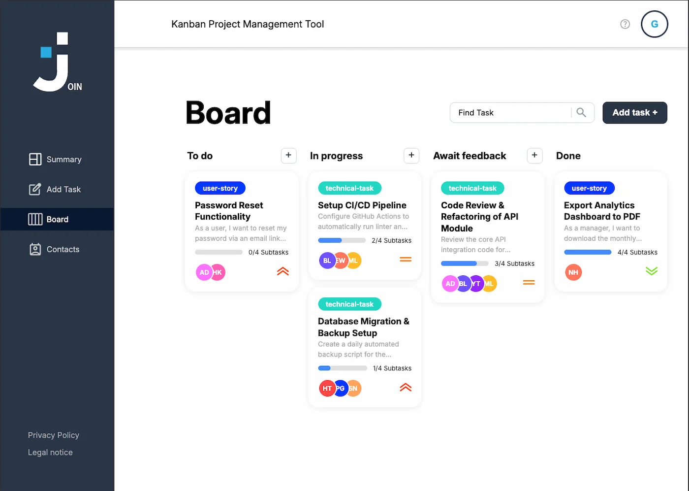

# Join — Kanban Project Management Tool

A task management web app with a kanban board, built as a team project
at Developer Akademie.

**[Live Demo](https://join.mustafa-impis.de)**



## About

Join is a kanban-style project management tool developed by a team of
five as part of the Developer Akademie web development program. Users
organize tasks across four workflow columns, assign contacts, track
subtask progress, and manage a shared contact list — all in the
browser, backed by Firebase.

## Features

- **Authentication** — sign up with email and password, or explore the
  app instantly via one-click guest login
- **Summary dashboard** — key metrics at a glance: task counts per
  column, upcoming deadlines, and a personal greeting
- **Kanban board** — four columns (To do, In progress, Await feedback,
  Done) with drag & drop, task search, and quick-add per column
- **Task editor** — categories (User Story / Technical Task),
  priorities (Urgent / Medium / Low), due dates, subtasks with
  progress tracking, and contact assignment
- **Contacts** — full CRUD with auto-generated avatar initials and a
  dedicated mobile view
- **Responsive design** — works on desktop and mobile

## Tech Stack

- **Frontend:** HTML, CSS, Vanilla JavaScript — no frameworks, no
  build tools
- **Backend:** Firebase Authentication and Firebase Realtime Database
- **Documentation:** JSDoc

## Try It Out

The live demo runs on a **shared demo database**: all visitors work on
the same dataset, and anything you create is visible to other
visitors. Please don't enter real personal data — this is a portfolio
demonstration project.

Use the guest login for instant access, or register a demo account.

## Local Development

No build step required — the app runs as static files.

```bash
git clone https://github.com/Payitahtlabs/Join.git
```

Open `index.html` with a local web server (e.g. the VS Code Live
Server extension). The included Firebase configuration points to the
shared demo project, so the app works out of the box. If you fork this
project, replace `scripts/firebaseConfig.js` with your own Firebase
project credentials.

## Documentation

Code documentation is generated with JSDoc:

```bash
npm install
npm run doc
```

The generated documentation is placed in the `out/` directory.

## Legal

[Legal Notice](https://join.mustafa-impis.de/sites/logout-legal.html) ·
[Privacy Policy](https://join.mustafa-impis.de/sites/logout-privacy.html)
